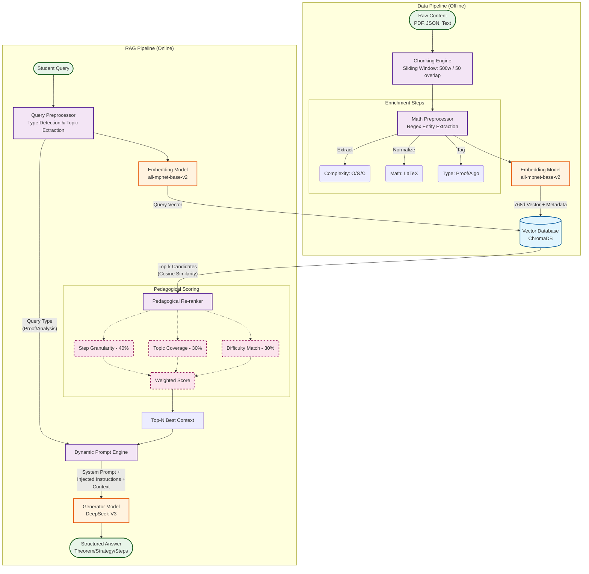

# AlgoRAG System Architecture Flowchart

This document contains the MermaidJS code for the AlgoRAG system architecture. You can render this in any Markdown viewer that supports Mermaid (like GitHub, VS Code, or Obsidian) or use the [Mermaid Live Editor](https://mermaid.live).

